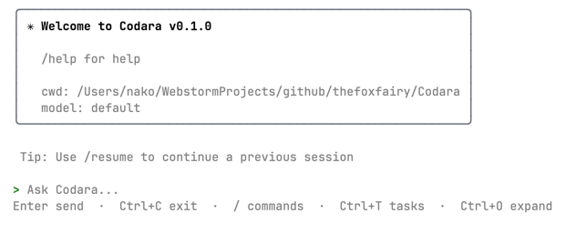

# Codara

<p align="center">
  终端优先的 Agent 运行时，面向真实开发工作流。
</p>

<p align="center">
  
  
  
  
</p>

<p align="center">
  <a href="#快速开始">快速开始</a>
  ·
  <a href="#架构">架构</a>
  ·
  <a href="#多端接入">多端接入</a>
  ·
  <a href="#核心机制">核心机制</a>
  ·
  <a href="#常用命令">命令</a>
</p>

Codara 把会话、任务、子代理、权限、多 Agent 协作和 IM 渠道接入收进同一套 Bun + TypeScript 运行时。不是聊天壳，是可以直接运行、验证和扩展的 Agent 执行引擎。

<p align="center">
  
</p>

---

## 架构

> 完整架构蓝图见 **[ARCHITECTURE.md](./ARCHITECTURE.md)**

DDD 轻量分层，10 个限界上下文，严格单向依赖：

```
src/
├── core/              执行引擎（Agent Loop + Pipeline + Middleware）
├── capability/        领域能力（Skill · Task · Command）
├── durability/        持久化（Session · Checkpoint）
├── observability/     观测（Runtime Events · Lifecycle Hooks）
├── integration/       集成适配（Tool · MCP · Channel · Provider）
├── context/           上下文来源（Instructions · Prompts · Skills）
├── config/            配置管理
├── codara/            应用层（Runtime 装配 + API 门面）
├── gateway/           消息网关（IM 渠道统一接入）
├── cli/               终端 UI（Ink）
├── desktop/           桌面 UI（React + Tauri v2）
├── server/            HTTP/SSE 服务
├── bus/               通信基础设施
└── shared/            共享内核（跨上下文契约）
```

**依赖方向：** `展示层 → 应用层 → 领域层 → 基础设施层 → 共享内核`

```
┌─ 展示层 ────────────────────────────────────────────┐
│  cli/  │  desktop/  │  server/  │  gateway/          │
└────────────────────┬────────────────────────────────┘
                     │
┌─ 应用层 ───────────┴────────────────────────────────┐
│  codara/ (assembly + facade + entrypoints)          │
└────────────────────┬────────────────────────────────┘
                     │
┌─ 领域层 ───────────┴────────────────────────────────┐
│  core/  │  capability/  │  durability/  │  observability/  │
└────────────────────┬────────────────────────────────┘
                     │
┌─ 基础设施层 ───────┴────────────────────────────────┐
│  integration/  │  context/  │  config/  │  bus/      │
└────────────────────┬────────────────────────────────┘
                     │
┌─ 共享内核 ─────────┴────────────────────────────────┐
│  shared/ (contracts + types + utils)                │
└─────────────────────────────────────────────────────┘
```

---

## 多端接入

### 本地

| 端 | 入口 | 说明 |
|----|------|------|
| **CLI** | `bun run dev` | Ink 终端 UI，直接调用 Runtime |
| **Desktop** | `bun run dev:desktop` | React + Tauri v2，通过 Server SSE 通信 |
| **Server** | `bun run dev:server` | HTTP/SSE 服务，为 Desktop 和 API 客户端提供后端 |

### 消息网关（Gateway）

通过 `bun run dev:gateway` 启动，统一接入 7 个 IM 渠道：

| 渠道 | 协议 | review 交互 |
|------|------|---------|
| **Telegram** | Bot API 长轮询 | InlineKeyboard 按钮 |
| **飞书** | Open API + Webhook | 交互卡片 |
| **钉钉** | Robot API + Webhook | ActionCard |
| **QQ** | OneBot v11 WebSocket | 文本数字选项 |
| **企业微信** | 官方 API + AES 加解密 | 模板卡片按钮 |
| **Discord** | Gateway WebSocket + REST | Button 组件 |
| **Slack** | Socket Mode + Web API | Block Kit 按钮 |

**会话管理：** 4 种 DM 作用域（`main` / `per-peer` / `per-channel-peer` / `per-account-channel-peer`），跨渠道身份链接（Identity Links），文件持久化 + idle/daily 重置策略。

配置：`~/.codara/gateway.json`

```json
{
  "channels": {
    "telegram": {
      "enabled": true,
      "accounts": {
        "default": { "botToken": "$TELEGRAM_BOT_TOKEN" }
      }
    }
  },
  "session": {
    "dmScope": "per-channel-peer",
    "resetPolicy": { "mode": "idle", "idleMinutes": 120 }
  }
}
```

---

## 核心机制

### Agent Loop

每个 Agent 运行 `model → tools → model` 循环。所有路径 **Stream-First**（AsyncGenerator），delegation 走统一 `stream()` 链路。

### Middleware Pipeline — 6 个拦截点

| 阶段 | 时机 | 核心 Middleware |
|------|------|----------------|
| BeforeAgent | 启动前 | Skills 注入 · PathInstructions |
| BeforeModel | LLM 调用前 | Budget · Summary 压缩 |
| ModelCall | 推理时 | Logging |
| **ToolCall** | **工具执行** | **Permission (deny→ask→allow) → review pause/resume** |
| AfterModel | 推理后 | Logging · Checkpoint |
| AfterAgent | 结束后 | Hooks · Cleanup |

### Review

工具执行可被 Permission 中间件拦截 → 通过 ChannelRegistry 路由到对应交互通道 → 用户审批/拒绝 → 恢复执行。

支持 CLI 终端审批、Desktop 对话框、IM 按钮（7 渠道均支持）。

### Task Delegation

- **Task** — 单代理派发。主 Agent spawn 子 Agent，stream 化执行，活动实时上报；需要并行时由主 Agent 调度多个 delegated subagents，而不是再引入第二套协作 runtime。

### 三层扩展体系

```
Skill（用户态能力包）    ← SKILL.md 发现 → skills middleware 注入
  ↓ 通过 middleware 注入
Hook（生命周期桥接）     ← 只能观测，不控制执行
  ↓ 通过 middleware 桥接
Middleware（第一扩展机制） ← 拦截、修改、放行、阻断
```

### Session & Checkpoint

- **Session** — 会话元数据，支持恢复/归档
- **Checkpoint** — Agent 完整状态快照，原子写入，compact 压缩
- **Lock** — Advisory 文件锁（PID + 5min TTL stale 检测）

---

## 快速开始

```bash
bun install
bun run dev         # CLI 开发模式
```

## 常用命令

```bash
bun run dev           # CLI（watch）
bun run dev:gateway   # 消息网关（IM 渠道）
bun run dev:server    # HTTP/SSE 服务
bun run dev:desktop   # 桌面端
bun run test          # 测试（1450+ tests）
bun run typecheck     # 类型检查（0 errors）
bun run lint          # 代码规范（0 errors）
bun run build         # 构建
```

## 技术栈

| 层 | 技术 |
|----|------|
| Runtime | Bun |
| Language | TypeScript (strict) |
| CLI | Ink (React for terminal) |
| Desktop | React + Vite + Tauri v2 |
| LLM | LangChain (Claude / GPT / Gemini / DeepSeek / ...) |
| MCP | @modelcontextprotocol/sdk |
| Gateway | 7 IM channels (Telegram / Feishu / DingTalk / QQ / WeCom / Discord / Slack) |
| Validation | Zod |
| Testing | Bun test (1450+ tests) |
| Build | tsc + tsc-alias |
