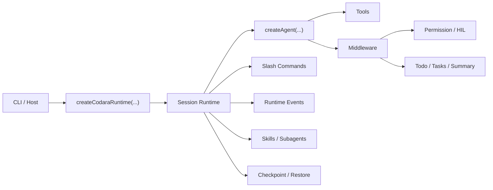

# Codara

Codara 是一个终端优先的代码代理 runtime。它把 `createAgent(...)` 执行内核、session/checkpoint、skills、tasks、permission/HIL、slash commands 和 CLI 宿主收敛成一条完整产品链路，目标不是“能跑一个 agent”，而是把真实编码工作流跑顺。

如果你想找的是：

- 一个可以直接装配出完整 coding runtime 的 core 入口
- 一套不会把 command、permission、skills、tasks 分裂成多份实现的架构
- 一个以 `tests/cases` 端到端验证为主，而不是只停在 unit test 的代码代理项目

那这个仓库就是按这个方向在收。

## Why Codara

很多 agent 项目能做对话，少数能做工具调用，但一到真实工程流程就会散掉：session 归 session、CLI 归 CLI、skills 归 skills、commands 再来一套私有逻辑。Codara 的取向相反，它强调一件事:

**把产品能力留在 `src/core`，把宿主层做薄。**

这带来几件直接结果：

- `createCodaraRuntime(...)` 是强默认入口，不需要手动拼 todo、`Task`、shared tasks、permission、HIL、summary
- slash commands 由 core 持有，CLI 只消费 command surface 和 host actions
- skills、subagents、shared tasks、runtime events 走同一套 session/runtime 边界，不发明第二套协议
- 验收优先看 `tests/cases/*.case.test.ts` 的真实工作流，而不是只看局部单测

## What You Get

- **完整 runtime 默认值**
  默认装配 todo、`Task`、`TaskCreate`、`TaskUpdate`、`TaskList`、logging、context budget、summary、permission/HIL。
- **统一 command surface**
  `/help`、`/clear`、`/status`、`/memory`、`/permissions`、`/plugin`、`/resume`、`/compact`、`/reload` 都由 `src/core/commands` 提供。
- **skills 与 command 一体化**
  skill commands 会进入 `/help`，执行前会检查 `allowed-tools` 和 shell binary 依赖。
- **可观察的 runtime**
  session/runtime 会发出 turn、model、tool、task、hil、command、summary 事件，CLI 基于事件流渲染步骤与状态。
- **终端产品能力而不是 demo**
  支持 session reopen、context compact、source reload、permission settings、plugin compatibility 和 real CLI path cases。

## Runtime Shape



核心原则：

- `src/core/agents` 负责执行，不负责宿主产品面
- `src/core/codara` 负责 runtime 默认装配和 facade
- `src/core/commands` 负责 slash commands，不下沉到 CLI
- `src/core/sessions` 负责 session lifecycle、runtime events、state 协调
- `src/core/tasks` 负责 `Task` 与 shared task coordination
- `src/cli` 只消费 core 暴露的 runtime、events、commands、host actions

## Quick Start

安装依赖：

```bash
bun install
```

启动 CLI：

```bash
bun run dev
```

日常校验：

```bash
bun run check:fast
```

端到端验收：

```bash
bun run check:cases
```

完整基线：

```bash
bun run check
```

## Command Surface

当前 built-in commands：

| Command | Purpose |
| --- | --- |
| `/help` | 分页列出 commands，支持 `/help <command>` 查看详情和运行前提 |
| `/clear` | 清空当前 conversation state，保留当前 `sessionId` |
| `/status` | 查看 runtime、session、context、memory、permissions 状态 |
| `/memory` | `show / project / global`，并通过 host action 打开 `AGENTS.md` |
| `/permissions` | `show / edit`，并通过 host action 打开 `.codara/settings.local.json` |
| `/plugin` | 安装 Claude 风格 plugin 资源到现有 skills/commands 体系 |
| `/resume` | 通过 `sessionId` 重新打开历史会话 |
| `/compact` | 压缩 conversation context，或整理 checkpoint 历史 |
| `/reload` | 刷新 `AGENTS.md` 与 skills source cache |

skill commands 也走同一套 surface：

- `/help` 会把它们和 built-in commands 分组展示
- `/help <skill-command>` 会显示 execution mode、scope、`allowed-tools`、required shell commands
- 执行前会做 preflight，缺 runtime tools 或缺 shell command 时会直接给出可操作提示

## Plugin Compatibility

Codara 不单独引入第二套 plugin runtime，而是把 Claude 风格插件映射到现有 skills/commands 体系。

当前已验证：

- `/plugin install superpowers@claude-plugins-official`
- `/plugin install code-review@claude-plugins-official`
- `/plugin install skill-creator@claude-plugins-official`

兼容策略：

- 插件有 `skills/*` 时，直接导入 `.codara/skills`
- 插件只有 `commands/*.md` 时，翻译成 Codara skill command 再导入
- 默认安装到全局 `~/.codara/skills`
- 如果项目 `.codara/settings.json` 配置 `"plugins": { "installGlobal": false }`，则默认安装到当前项目 `.codara/skills`

## Validation

这个仓库默认把 `tests/cases` 当成主验收面。

推荐顺序：

```bash
bun run check:fast
bun test tests/cases
```

如果你只在改 command surface，这组会更直接：

```bash
bun test tests/unit/core/codara-commands.test.ts
bun test tests/unit/core/codara-skill-commands.test.ts
bun test tests/unit/core/skill-command-requirements.test.ts
bun test tests/unit/core/docs-contract.test.ts
bun test tests/cases/runtime/command-surface.case.test.ts
bun test tests/cases/runtime/skill-command-preflight.case.test.ts
```

## Codebase Guide

如果你要读这个仓库，先按“产品装配 -> session runtime -> command surface -> 高阶工作流”的顺序看，不要一上来扎进某个零散 middleware。

### 先看这些文件

1. `src/core/README.md`
   先建立整体边界，知道 `agent`、`codara`、`session`、`middleware`、`skills`、`tasks` 各自是谁的 owner。
2. `src/core/codara/facade.ts`
   看默认 runtime 是怎么装出来的，以及为什么 `createCodaraRuntime(...)` 是产品入口。
3. `src/core/sessions/session.ts`
   看 session lifecycle、runtime events、command execution 和 state 管理怎样落在一起。
4. `src/core/commands/builtin/help.ts`
   看 command surface 怎样保持在 core，`/help` 怎样消费统一 metadata。
5. `src/core/tasks/README.md`
   看 `src/core/tasks` 里的 `Task`、shared tasks、subagent coordination 怎样成为工作流主线。

### 主要目录

| Path | Responsibility |
| --- | --- |
| `src/core/agents` | `createAgent(...)`、tool loop、checkpoint runtime glue |
| `src/core/codara` | facade、默认 runtime 装配、session 打开与恢复 |
| `src/core/commands` | slash command registry、host action protocol、skill command binding |
| `src/core/middleware` | logging、summary、todo、interaction/HIL、permission、context budget |
| `src/core/provider` | provider registry、router、model factory |
| `src/core/sessions` | session lifecycle、runtime events、checkpoint/session state coordination |
| `src/core/skills` | skill store、runtime、command discovery、subagent definitions |
| `src/core/tasks` | `Task`、shared task store、subagent coordination |
| `src/cli` | Ink CLI，消费 core 暴露的 runtime、events、commands |
| `tests/unit` | owner-level unit tests |
| `tests/integration` | provider stack 与跨模块 integration tests |
| `tests/cases` | 真实工作流与 real CLI path 的 end-to-end cases |
