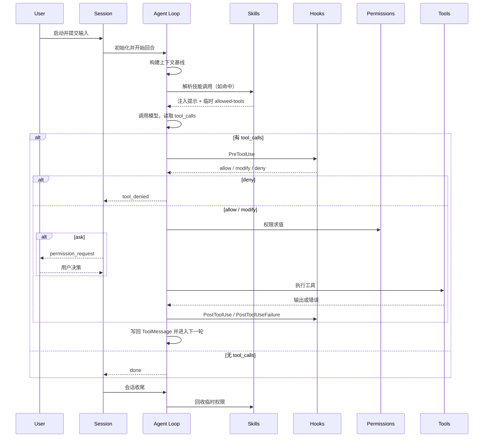

# Codara 架构概览

> [目录](./README.md) | [下一篇: 模型路由 →](./01-model-routing.md)

Codara 是一个终端内运行的 AI 工程代理系统，核心设计是 `Agent Loop + Hooks + Skills`。

本文是架构蓝图，目标是让任何代码终端在不依赖具体目录结构的前提下，都能按同一机制实现一致行为。

## 架构目标

1. 核心运行时长期稳定，避免因单一业务场景频繁改动主循环。
2. 所有场景能力可扩展，优先通过 Skills 组合实现。
3. 工具调用可控，具备可拦截、可授权、可审计、可回滚能力。
4. 上下文可持续运行，长会话下仍保持可用与可预测。

## 核心设计

Codara 采用“核心机制 + 策略扩展”双层设计。

- 核心机制层负责稳定语义：回合推进、工具调度、权限求值、钩子事件、记忆与压缩。
- 策略扩展层负责场景编排：代码审查、提交流程、部署规范、团队约束。

这意味着：
- 机制问题改核心。
- 策略问题改 Skill。
- 不把团队流程硬编码进主循环。

## 分层职责与边界

| 层 | 主要输入 | 主要输出 | 负责 | 不负责 |
|---|---|---|---|---|
| 会话编排层 | CLI 参数、运行配置、用户输入 | 会话生命周期、事件流消费 | 启动与结束编排、交互/非交互路由 | 业务策略判定 |
| Agent Loop 层 | 消息历史、模型响应、工具结果 | 回合推进、`done` 原因 | 状态推进与主路径调度 | 场景流程硬编码 |
| Middleware 层 | 生命周期事件、工具调用上下文 | 拦截结果、授权决策、审计副作用 | hooks、permissions、guardrail、checkpoint、audit | 直接渲染 UI |
| Tools 层 | 结构化工具参数 | 工具输出或错误 | 原子能力执行 | 生命周期编排 |
| Context/Memory 层 | 项目指令、记忆快照、会话历史 | 模型可消费上下文 | 上下文组装、压缩、持久化 | 工具授权 |
| Skills 层 | 用户意图、技能定义、技能参数 | 提示注入、临时权限、技能钩子配置 | 场景化能力封装与复用 | 修改核心循环语义 |

## 机制与策略的落点规则

1. 多个团队都复用且语义稳定的能力，进入核心机制层。
2. 跟项目约束强相关、变化频繁的能力，进入 Skills。
3. 无法判断时，先 Skill 试运行，稳定后再评估是否核心化。

## 统一术语

| 术语 | 定义 |
|---|---|
| 回合（turn） | 一次“模型调用 + 可选工具调用 + 状态回写”的推进单位 |
| 工具调用（tool call） | 模型产出的结构化工具请求，包含工具名与参数 |
| 阻断（block/deny） | 调用在执行前被拒绝，通常来自 Hook、Permission 或 Guardrail |
| 询问授权（ask） | 权限层要求用户决策后才继续执行 |
| 临时权限 | Skill 激活期间注入的临时 `allow` 规则，结束后回收 |
| 会话级钩子视图 | 初始化阶段合并后的 Hook 配置，贯穿整个会话 |
| done reason | 会话终止原因，必须可观测且可追踪 |

## 跨层统一标识（实现必须一致）

为确保 hooks、permissions、skills、subagent、UI 与日志可以稳定关联，运行时应统一以下标识字段：

| 字段 | 作用域 | 生成时机 | 用途 |
|---|---|---|---|
| `session_id` | 会话级 | 会话启动 | 跨回合关联全链路 |
| `turn_id` | 回合级 | 每轮开始 | 关联同轮模型调用与工具调用 |
| `request_id` | 工具调用级 | 每次工具调用前 | 关联 `PreToolUse -> Permission -> Tool -> PostToolUse` |
| `event_id` | 事件级 | 事件发射时 | 去重、重放保护、日志关联 |
| `skill_invocation_id` | 技能调用级 | 命中 `/skill` 时 | 关联技能注入、临时权限与工具行为 |
| `agent_id` | 代理级 | 代理实例创建时 | 区分主代理与子代理行为 |
| `parent_agent_id` | 代理级 | 子代理创建时 | 追踪委派链与故障传播边界 |
| `team_id` | Team 级 | Team 实例创建时（启用 Team 模式） | 区分 Leader/SubTeam 来源 |
| `process_id` | 进程级 | Team 进程启动后（启用 Team 模式） | 进程隔离与故障回收定位 |
| `delegation_id` | 委派级 | Leader 派发任务时（启用 Team 模式） | 关联跨 Team 的任务与消息链路 |

传递约束：

1. `request_id` 必须透传到 Hook、Permission、Tool、PostHook 及审计日志。
2. 子代理上报事件必须同时包含 `agent_id` 与 `parent_agent_id`。
3. 技能触发的工具调用必须携带 `skill_invocation_id`；非技能调用可留空。
4. UI 层只消费这些标识，不重新生成业务级标识。
5. 启用 Team 模式时，跨 Team 事件必须同时携带 `team_id + process_id + delegation_id`。

---

## 运行时主线

### 全局时序

### 阶段 1：启动

1. 读取运行参数与配置，确定权限模式、模型路由和会话模式。
2. 创建会话与事件通道，准备消费 `AgentEvent`。
3. 构造 Agent Loop 与中间件管线。

### 阶段 2：初始化

初始化是会话级动作，通常只执行一次。

1. 装载项目指令与记忆快照，形成初始上下文基线。
2. 发现并注册技能元数据。
3. 加载 hooks 配置（含技能钩子），形成会话级 HookEngine。
4. 绑定工具 schema 到模型实例。
5. 触发 `SessionStart` 事件。

### 阶段 3：回合执行

每轮执行遵循同一主路径：

1. 检查安全阀（轮次、预算、超时、中断）。
2. 检查上下文容量，必要时触发压缩。
3. 调用模型并接收流式响应。
4. 以 `tool_calls` 作为主分支信号：
   - 有 `tool_calls`：进入工具调用管线。
   - 无 `tool_calls`：进入结束路径。
5. 根据 `done` 原因结束或继续下一轮。

`stop_reason` 仅用于边界处理，不替代 `tool_calls` 主路径。

### 阶段 4：工具调用管线

每次工具调用的统一顺序：

1. `PreToolUse`：拦截、改写、阻断。
2. `Permissions`：求值 `deny / ask / allow`。
3. `Tool Execute`：执行原子能力。
4. `PostToolUse` / `PostToolUseFailure`：记录、通知、补充处理。

这一顺序定义了体系边界：
- 前置策略在 Hook。
- 授权策略在 Permission。
- 执行语义在 Tool。
- 后置副作用在 Post Hook。

### 阶段 5：会话结束

1. 输出明确 `done` 原因。
2. 持久化会话状态与必要记忆。
3. 回收技能临时权限。
4. 触发 `SessionEnd` 或 `Stop` 相关事件。

### 运行时不变量

1. 主分支只由 `tool_calls` 决定：有则执行工具，无则进入结束路径。
2. 任一终止路径都必须输出明确 `done reason`。
3. 授权交互必须可恢复：`permission_request` 不得导致死等。
4. 临时权限必须在会话收尾阶段回收，包括异常结束路径。
5. 工具调用顺序固定：`PreToolUse -> Permissions -> Tool -> PostToolUse`。

### 终止原因矩阵

| done reason | 触发条件 | 恢复策略 |
|---|---|---|
| `complete` | 模型无 `tool_calls`，任务自然完成 | 无需恢复，进入收尾 |
| `max_turns` | 达到回合上限 | 由用户或上层会话重启 |
| `max_budget` | 达到预算上限 | 调整预算后重试 |
| `timeout` | 会话或调用超时 | 缩小任务范围后重试 |
| `interrupted` | 用户主动中断 | 保留状态，后续续跑 |
| `refusal` | 模型拒绝继续 | 改写提示或更换模型 |
| `error` | 运行时异常或外部失败 | 记录错误并进入人工处理 |

## 架构能力升级（产品视角 + 开发者视角）

本节定义下一阶段的架构升级方向，目标是提升可用性与可维护性，而不是增加新功能入口。

### 双视角目标

| 视角 | 目标 | 直接收益 |
|---|---|---|
| 产品 | 降低不确定性与打断感 | 授权体验更稳定、失败可恢复、行为可预期 |
| 开发 | 提升可验证性与可调试性 | 状态可追踪、扩展可组合、问题可定位 |

### 升级项 A：回合状态机化

将运行时阶段固定为可验证状态机，建议最小状态集合：

`INIT -> READY -> MODELING -> TOOL_PRECHECK -> TOOL_AUTH -> TOOL_RUN -> TOOL_POST -> TURN_CLOSE -> DONE`

约束：

1. 非法跳转一律视为运行时错误并记录。
2. 每个状态都需有进入/退出事件，供日志与调试使用。
3. 权限询问只允许在 `TOOL_AUTH` 状态发出。

### 升级项 B：统一裁决引擎

把 `hooks + permissions + skills allowed-tools` 收敛为统一裁决流程，输出标准化决策：

`Decision = { deny | ask | allow, source, reason, mutableInput? }`

约束：

1. 决策来源必须可追踪（hook / permission / skill / user）。
2. 同一工具调用只产生一个最终决策，避免多层冲突覆盖。
3. 决策与执行结果必须可关联（同一 request_id / turn_id）。

### 升级项 C：上下文构建引擎化

上下文组装由“隐式拼接”升级为“可配置管线”：

1. 固定阶段：`base -> memory -> user -> skill -> tool_result -> budget_check`。
2. 每阶段输出 token 预算与裁剪报告。
3. 发生压缩时保留不可压缩元数据与最近工具事实。

### 升级项 D：故障域与恢复域拆分

把故障隔离为四类域：模型域、工具域、权限域、渲染域。

约束：

1. 单域失败优先局部降级，不直接终止整会话。
2. 仅当恢复策略不可用时，才进入 `done=error`。
3. 每次失败都要附带下一步建议动作（retry / rollback / re-ask / abort）。

### 升级项 E：扩展契约版本化

对 hooks、skills、agent 定义引入契约版本标记（例如 `contract_version`）。

约束：

1. 核心运行时只保证已声明版本的兼容性。
2. 契约升级需提供迁移提示与回退策略。
3. 不允许未声明版本的扩展静默加载。

---

## Context 构建机制

### 四层上下文模型

| 层级 | 内容来源 | 注入时机 | 变更频率 | 作用 |
|---|---|---|---|---|
| 系统层 | 基础系统提示、运行规则 | 初始化 | 低 | 保证模型行为边界 |
| 项目层 | 项目指令、项目约束 | 初始化 + 配置变更后 | 中 | 绑定仓库级规范 |
| 记忆层 | 长期记忆、会话摘要、关键事实 | 初始化 + 压缩后 | 中 | 维持长期连续性 |
| 回合层 | 用户消息、工具结果、技能注入 | 每轮 | 高 | 驱动当前任务推进 |

### 每轮上下文组装顺序

1. 继承系统层与项目层基线。
2. 合并有效记忆片段。
3. 追加当前会话历史与最新用户输入。
4. 如果命中 Skill，注入技能提示与参数展开结果。
5. 追加上一轮工具结果。
6. 执行上下文预算检查与压缩。

### Context 重建触发点

1. 会话初始化完成后，构建第一版上下文基线。
2. 每次用户提交输入后，触发新一轮上下文组装。
3. 每次工具执行完成并回写结果后，触发下一轮上下文组装。
4. 发生压缩后，使用压缩产物重建上下文窗口。
5. 配置或会话状态变化时，按需重建上下文基线。

### 注入优先级

上下文冲突时按以下优先级处理：

1. 系统约束优先，禁止被技能或用户输入覆盖。
2. 项目约束次之，约束当前仓库行为边界。
3. 技能注入用于场景策略，不应突破上层约束。
4. 用户当前输入决定本轮目标。
5. 工具结果作为最新事实，驱动下一轮决策。

### 长会话压缩策略

1. 压缩目标是“保留决策信息”，不是“保留完整对话”。
2. 压缩后必须保留关键约束、未完成任务、最新工具状态。
3. 压缩标记应进入消息历史，防止模型丢失阶段边界。

---

## Skills 的使用时机与作用方式

### 何时使用 Skills

1. 需要场景化流程编排时使用 Skills。
2. 需要团队复用同一流程时使用 Skills。
3. 需要把 hooks、permissions、提示模板打包管理时使用 Skills。

不应使用 Skills 的情况：
- 需要改变 Agent Loop 主路径语义。
- 需要新增底层工具协议。
- 需要修改权限引擎求值规则本身。

### Skills 生命周期

1. 发现：初始化阶段扫描技能定义并注册元数据。
2. 注册：加载技能钩子到会话级 HookEngine。
3. 激活：用户命中技能时注入提示与临时权限。
4. 执行：技能触发的工具调用走同一工具管线。
5. 回收：技能结束后撤销临时 `allowed-tools`。

### 技能激活与钩子的关系

1. 技能钩子在初始化阶段注册，进入会话级钩子视图。
2. `/skill` 调用只激活提示与临时权限，不在运行时动态挂载钩子。
3. 技能调用结束仅回收临时权限，钩子状态随会话结束统一释放。

### 临时权限回收边界

以下路径都必须触发临时权限回收：

1. 正常完成（`complete`）。
2. 工具被拒绝或权限拒绝。
3. 运行时异常（`error`）。
4. 用户中断（`interrupted`）。
5. 任何提前终止路径（如 `max_turns`、`timeout`）。

### Skills 对运行时的三类影响

1. 提示影响：注入技能正文、参数模板、动态上下文。
2. 权限影响：注入临时 allow 规则（受全局 deny 约束）。
3. 钩子影响：技能钩子在会话内常驻，按事件触发执行。

---

## Hooks 周期与职责

### 事件层次

| 事件层次 | 典型事件 | 作用 |
|---|---|---|
| 会话级 | `SessionStart`、`SessionEnd` | 会话初始化与收尾 |
| 输入级 | `UserPromptSubmit` | 输入预处理与策略检查 |
| 工具级 | `PreToolUse`、`PostToolUse`、`PostToolUseFailure` | 拦截、审计、补偿 |
| 控制级 | `Stop`、`PermissionRequest` | 停止控制与授权交互 |

### Hook 合并顺序

同一事件下，钩子按以下顺序合并与执行：

1. 项目配置钩子。
2. 项目技能钩子。
3. 用户技能钩子。

执行原则：首个拒绝短路，后续不再执行。

### PreToolUse 与 PostToolUse 的边界

- `PreToolUse`：做输入校验、命令阻断、参数改写。
- `PostToolUse`：做日志记录、通知、结果标注。
- `PostToolUseFailure`：做失败审计与补偿动作。

---

## 用 Skills + Hooks + Permissions 实现拦截、校验、日志、阻断

| 目标 | 首选落点 | 执行方式 | 关键约束 |
|---|---|---|---|
| 阻断危险命令 | Skill 的 `PreToolUse` | 返回 deny 或退出码拒绝 | 必须有拒绝原因 |
| 参数净化/改写 | Skill 的 `PreToolUse` | 返回 modify 动作 | 改写后仍走权限求值 |
| 减少高频授权弹窗 | Skill `allowed-tools` | 注入临时 allow 规则 | 用户 deny 永远优先 |
| 审计日志 | Skill 的 `PostToolUse` | 记录工具入参与结果 | 不应影响主路径推进 |
| 失败告警 | `PostToolUseFailure` | 输出错误摘要并通知 | 不掩盖原始错误 |
| 强制合规检查 | `PreToolUse + permissions` | 先校验，再授权 | 两层都要覆盖 |

### PreTool 场景标准流程

1. 技能定义声明 `hooks` 与 `allowed-tools`。
2. 会话初始化时注册技能钩子。
3. 技能激活时注入提示与临时权限。
4. 工具调用先进入 `PreToolUse`。
5. `PreToolUse` 若拒绝，调用立即阻断。
6. 未拒绝则进入 Permission 求值；若结果为 `ask`，发出 `permission_request` 事件等待用户决策。
7. 通过授权后执行工具。
8. `PostToolUse`/`PostToolUseFailure` 负责日志和后处理。
9. 技能结束后回收临时权限。

这条流程保证“拦截、授权、执行、审计”四段职责清晰且不串层。

---

## 权限求值与 Block 语义

### 权限求值链

权限引擎按固定顺序求值：

1. 全放行模式短路（高风险）。
2. 只读计划模式特判。
3. `deny` 规则。
4. `ask` 规则。
5. `allow` 规则（含技能临时规则）。
6. 只读工具豁免。
7. 编辑友好模式补充。
8. 不询问模式兜底拒绝。
9. 默认询问。

### Block 来源

工具调用被阻断通常来自三类来源：

1. Hook 阻断：`PreToolUse` 明确拒绝。
2. Permission 阻断：命中 `deny` 或用户拒绝。
3. Guardrail 阻断：输入不满足安全约束。

### 设计要求

1. 每次阻断都要有可解释原因。
2. 阻断结果要进入事件流，供 UI 与日志系统消费。
3. 阻断不应破坏会话整体可恢复性。

### Block 与日志最小字段

发生阻断、拒绝或授权询问时，日志与事件至少应包含：

1. `session_id`：会话标识。
2. `turn_id`：回合标识。
3. `request_id`：工具调用标识。
4. `event_id`：事件标识。
5. `tool_name`：工具名称。
6. `decision`：`deny / ask / allow`。
7. `source`：来源（hook / permission / guardrail / user）。
8. `reason`：可解释原因。
9. `skill_invocation_id`：如由技能触发则必须填写。
10. `agent_id`：触发该行为的代理实例。
11. `team_id`：启用 Team 模式时的 Team 实例标识。
12. `process_id`：启用 Team 模式时的进程标识。
13. `delegation_id`：启用 Team 模式时的委派链路标识。
14. `timestamp`：时间戳。

---

## 多代理协作的边界

1. 主代理是唯一用户交互入口。
2. 子代理由主代理通过任务工具创建。
3. 子代理上下文隔离，不继承主会话全量历史。
4. 子代理结果以摘要形式回传，避免污染主上下文。
5. 子代理同样受 hooks 与 permissions 约束。

协作策略属于 Skills，协作机制属于核心运行时。

---

## 可观测性与故障处理

| 环节 | 关键事件/状态 | 失败处理 |
|---|---|---|
| 会话启动 | `SessionStart`、配置加载状态 | 启动失败直接终止并输出原因 |
| 回合执行 | `turn_start`、`text_delta`、`done` | 明确 `done reason`，禁止静默退出 |
| 工具调用 | `tool_start`、`tool_end`、`tool_denied` | 保留拒绝/失败原因并回写上下文 |
| 权限交互 | `permission_request` | 用户决策可恢复回合执行 |
| 压缩过程 | `compact_start`、`compact_end` | 压缩失败进入降级策略或终止 |

---

## 架构演进原则

1. 保持 Agent Loop 主路径稳定，不为单场景打补丁。
2. 扩展优先做 Skill，稳定后再考虑核心化。
3. 安全策略采用双层防护：Hook 前置 + Permission 授权。
4. 任何新增能力都应明确输入、输出、失败路径。
5. 文档描述聚焦机制契约，不绑定具体代码文件路径。

---

## 与后续章节的关系

- [01-模型路由](./01-model-routing.md)：模型选择与提供商映射。
- [02-代理循环](./02-agent-loop.md)：回合推进与事件流细节。
- [03-工具系统](./03-tools.md)：工具 schema 与执行模型。
- [04-生命周期钩子](./04-hooks.md)：Hook 事件、动作与执行约束。
- [05-记忆系统](./05-memory-system.md)：记忆注入、压缩与持久化。
- [06-技能系统](./06-skills.md)：Skills 发现、注入、权限、钩子编排。
- [07-代理协作](./07-agent-collaboration.md)：主从代理与任务协作。
- [08-终端界面](./08-terminal-ui.md)：交互渲染与事件消费。

---

> [目录](./README.md) | [下一篇: 模型路由 →](./01-model-routing.md)
