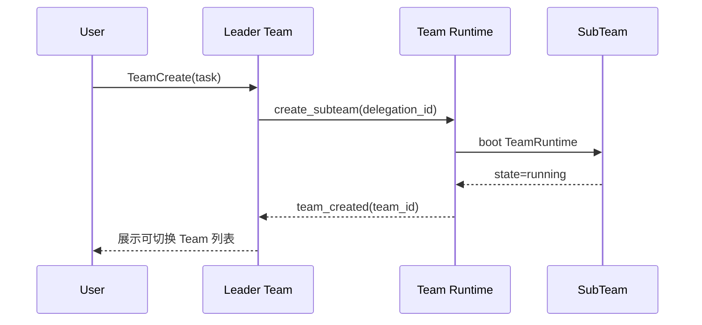
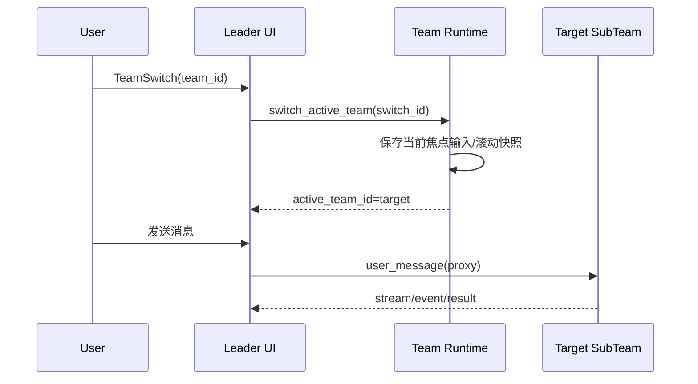
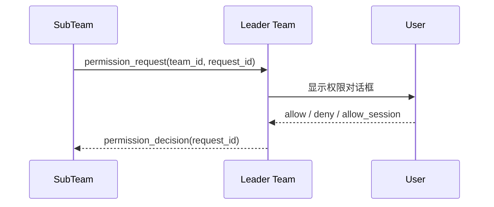

# Team 运行时设计

> [← 上一篇: 终端界面](./08-terminal-ui.md) | [目录](./README.md) | [相关章节: 07-代理协作](./07-agent-collaboration.md)

本文定义 Codara 的 Team 级协作模型，基线对齐你描述的 Claude Code 使用方式：

1. 启动一个窗口时，会创建一个 `Team Session`，其中当前实例就是 `Leader Team`（窗口主 Agent Loop）。
2. Leader 拉起的是与自己同一 Runtime 契约的 Team 实例（同构 Team），按独立实例隔离运行。
3. 一个 `Team Session` 由 `Leader Team + N 个同构 SubTeam` 组成。
4. Leader 可以切换到任意 SubTeam，并直接与该 SubTeam 交互。
5. Team 管理权只在 Leader；SubTeam 不能创建 Team（禁止递归扩张）。
6. `Leader` 在会话内固定，不能切换或转让。

---

## 设计目标

1. 保持现有 `Agent Loop + Hooks + Skills` 主路径不变。
2. 把 Team 作为“会话编排层”能力，而不是改写工具层语义。
3. 让切换、授权、日志、失败恢复都可追踪、可解释。
4. 保证 SubTeam 失控时不会拖垮 Leader 主会话。

## 与 Claude Code Team 形态对齐的硬约束

1. 一次会话只允许一个 Team（一个 Leader + 多个 SubTeam）。
2. Team 的 `Leader` 在会话内固定，不支持改选。
3. 不支持嵌套 Team：SubTeam 不能再创建 Team/SubTeam。
4. SubTeam 是独立会话上下文，不继承 Leader 历史消息。
5. SubTeam 与 Leader 共享同一项目上下文基线（指令、技能、MCP 连接能力）。

## 核心模型

### Team Session 与 Team 实例

先区分两层概念：

| 概念 | 定义 |
|---|---|
| `Team Session` | 一个窗口会话下的协作容器，包含 1 个 Leader Team 和 0..N 个 SubTeam |
| `Team 实例` | 一个可执行循环实例（可为 Leader 或 SubTeam） |

每个 Team 实例都由下列运行时对象组成：

`TeamRuntime = AgentLoop + MiddlewarePipeline + ContextState + ToolRegistry + EventStream + UIBinding`

在 Team 运行时中，`TeamEngine` 也应挂在 Middleware 之后工作，而不是直接驱动 Loop：

1. `TeamMiddleware` 处理 Team 级动作入口（create/switch/message/close）。
2. `TeamEngine` 负责 Team 策略决策（路由、幂等、锁、恢复）。
3. `TeamMiddleware` 根据 TeamEngine 决策执行副作用与事件回写。

说明：

1. Leader Team 绑定当前窗口，是该窗口唯一主循环。
2. SubTeam 不是页签别名，而是独立可执行循环实例。
3. 同一 Team Session 内，SubTeam 统一受 Leader 调度。

### 同构实例原则（关键）

Leader 与 SubTeam 使用同一 `TeamRuntime` 结构和同一执行主线：

`init -> loop -> hooks/permissions/tools -> done`

这表示：

1. SubTeam 不是“简化 Agent”，而是同构运行时实例。
2. 差异只在角色策略（Role Policy），不是循环语义差异。
3. 因此“Leader 拉起跟它一样的”在运行时层面成立。

同构不等于同权：

1. Leader 拥有 Team 管理权限（create/switch/close/message）。
2. SubTeam 默认仅保留任务执行权限，不开放 Team 管理动作。

### 实例隔离级别（对齐 Claude Code）

Team 设计应按“独立 Claude 实例”语义实现，最小要求为进程级隔离边界：

1. 每个 SubTeam 视为独立实例，而不是主循环内部线程分支。
2. 任一 Team 崩溃不应破坏其他 Team 的执行状态。
3. Team 间通信通过显式 IPC（消息/任务总线），而不是共享内存对象直接写入。

### 角色定义

| 角色 | 定义 | 能力边界 |
|---|---|---|
| `leader` | 窗口根 Team，唯一对用户直接可见 | 可创建/切换/关闭 SubTeam；可接管权限交互 |
| `subteam` | 由 Leader 创建的从属 Team | 可执行任务与跨队消息；不可创建/关闭/切换 Team；交互经 Leader 代理 |

### 标识字段

| 字段 | 含义 | 必填时机 |
|---|---|---|
| `team_id` | 当前 Team 实例 ID | Team 创建即生成 |
| `process_id` | Team 实例进程 ID | Team 进程启动后 |
| `parent_team_id` | 父 Team ID（Leader 为空） | SubTeam 创建时 |
| `leader_team_id` | 所属 Leader ID | Team 创建时 |
| `delegation_id` | 一次委派的全链路 ID | Leader 派发任务时 |
| `active_team_id` | 当前 UI 焦点 Team | 每次切换后更新 |
| `switch_id` | 一次切换动作 ID | 每次 TeamSwitch 时 |
| `idempotency_key` | 幂等去重键 | 每次可重试动作发起时 |
| `sequence_no` | 点对点有序序号 | 每次 TeamMessage 发送时 |

---

## 不变量（必须长期成立）

1. 每个窗口会话有且仅有一个 `leader` Team，且它就是窗口主 Agent Loop 实例。
2. Team 层级深度固定为 1（Leader -> SubTeam）。
3. `leader` 在会话内固定，禁止切换 Leader 角色。
4. `subteam` 禁止创建任何 Team（包括其他 SubTeam）。
5. 用户交互入口唯一在 Leader UI 层。
6. Team 切换只改变 UI 焦点，不合并上下文历史。
7. 任一 Team 的权限决策都必须可追溯到 `team_id + request_id`。
8. Team 间协作仅通过可审计总线（任务/消息），禁止隐式共享状态。
9. 每个 Team 实例必须映射到独立进程，不允许同进程线程化替代。

---

## 生命周期设计

### 状态机

| 状态 | 说明 | 允许迁移 |
|---|---|---|
| `booting` | Team 初始化 | `running` / `error` |
| `running` | 前台执行或前台待命 | `background` / `stopping` / `error` |
| `background` | 后台执行，不是当前焦点 | `running` / `stopping` / `error` |
| `stopping` | 收尾中 | `stopped` |
| `stopped` | 已终止 | 无 |
| `error` | 异常态 | `stopping` / `stopped` |

### Team 运行模式

Team 可支持两种显示/执行模式（对齐 Claude Code 的 teammate mode）：

1. `single-terminal`：多 Team 进程在同一终端内渲染与切换（进程独立，显示聚合）。
2. `tmux`：每个 SubTeam 在独立 tmux 会话执行（进程独立，窗口分离）。

约束：

1. 模式只影响 Team 容器与渲染，不影响 TeamRuntime 契约。
2. 无论哪种模式，Leader 仍是唯一 Team 管理入口。
3. 两种模式都必须维持“每 Team 一进程”的执行边界。

### 通信与协调通道（文件总线）

建议采用文件总线作为 Team 协调平面（与 Claude Code 机制一致）：

1. Team 配置存储：`~/.codara/teams/{team-name}/config.json`
2. 共享任务存储：`~/.codara/tasks/{team-name}/`
3. Team 消息邮箱：`~/.codara/teams/{team-name}/mailbox/{team-id}.jsonl`

说明：

1. `~/.claude/...` 是 Claude Code 的默认目录，不用于 Codara。
2. Codara 统一使用 `~/.codara/...`（用户级）与 `.codara/...`（项目级）约定。

并发约束：

1. 任务认领必须使用文件锁，避免多 Team 同时 claim 造成竞态。
2. 消息写入采用 append-only 语义，读取使用偏移或游标去重。
3. Team 清理只由 Leader 触发，防止残留 orphan 资源。
4. 文件写入必须采用原子落盘（临时文件 + rename）。

### 创建流程（Leader -> SubTeam）



### 切换与交互流程（Leader <-> SubTeam）



---

## 能力边界与拦截策略

### Leader 能做什么

1. 创建、列出、切换、关闭 SubTeam。
2. 向 SubTeam 发送指令或自然语言消息。
3. 代理 SubTeam 的权限询问、问题询问、中断控制。

### SubTeam 不能做什么

1. 不能创建 Team。
2. 不能切换其他 Team 焦点。
3. 不能直接弹出 UI 对话框。

### 双层防护（必须同时存在）

1. 工具注册层：SubTeam 的工具集不暴露 `TeamCreate/TeamSwitch/TeamClose`。
2. 权限层：即使被注入也由 `deny` 规则兜底拒绝 Team 管理动作。

### Team 管理动作错误码（建议统一）

| 错误码 | 含义 | 典型触发 |
|---|---|---|
| `TEAM_FORBIDDEN_ROLE` | 角色无权执行动作 | SubTeam 调用 `TeamCreate` |
| `TEAM_NOT_FOUND` | 目标 Team 不存在 | `TeamSwitch` 到已关闭 Team |
| `TEAM_STATE_CONFLICT` | 目标状态不允许该操作 | 对 `stopping` Team 继续切换 |
| `TEAM_LOCK_TIMEOUT` | 锁获取超时 | tasks/mailbox 文件锁竞争 |
| `TEAM_PROCESS_UNREACHABLE` | Team 进程不可达 | 目标 Team 已崩溃或通信中断 |
| `TEAM_MESSAGE_EXPIRED` | 消息超时失效 | 超过 TTL 的延迟消息 |

审计要求：

1. 错误日志必须包含 `error_code`、`team_id`、`request_id`、`idempotency_key`。
2. 权限拒绝必须附 `policy_source`（hook / permission / role-guard）。

---

## 交互协议（建议工具契约）

| 动作 | 发起方 | 输入 | 输出 |
|---|---|---|---|
| `TeamCreate` | Leader | task、team_type、mode | team_id、status |
| `TeamList` | Leader | 可选筛选条件 | Team 摘要列表 |
| `TeamSwitch` | Leader | target `team_id` | `active_team_id`、`switch_id` |
| `TeamMessage` | Leader / SubTeam | `team_id`、message | ack、message_id |
| `TeamOutput` | Leader | `team_id`、block? | 状态/摘要/错误 |
| `TeamClose` | Leader | `team_id`、reason | close_result |

协议约束：

1. 管理动作（`TeamCreate/TeamSwitch/TeamClose`）仅允许 Leader 发起。
2. `TeamMessage` 允许 Team 内部点对点通信，但必须带 `team_id + delegation_id`。
3. `TeamSwitch` 失败必须返回可解释原因（不存在、已停止、权限拒绝）。
4. `TeamMessage` 必须有超时和重试策略，避免焦点切换死锁。

### 协议可靠性契约（幂等 / 重试 / 顺序）

所有 Team 动作请求建议采用统一 envelope：

```json
{
  "request_id": "req_01...",
  "idempotency_key": "idem_01...",
  "source_team_id": "team_leader",
  "target_team_id": "team_sub_2",
  "action": "TeamMessage",
  "sequence_no": 42,
  "payload": {},
  "sent_at": "2026-03-02T10:00:00Z"
}
```

可靠性约束：

1. 相同 `source_team_id + action + idempotency_key` 必须只执行一次（建议去重窗口 10 分钟）。
2. 重试必须复用原 `idempotency_key`，禁止重试时改 key。
3. 重试次数建议最多 3 次，指数退避（例如 200ms / 1s / 3s）。
4. `TeamMessage` 在 `(source_team_id, target_team_id)` 维度按 `sequence_no` 单调递增处理。
5. 序号空洞时先缓存后续消息，直到缺失序号到达或超时补偿。
6. 每个请求都必须返回 `ack`：`{ request_id, status, error_code? }`。

### 任务认领一致性（共享 tasks）

对 `~/.codara/tasks/{team-name}/` 的并发访问，至少保证：

1. 状态迁移单向受控：`pending -> in_progress -> completed|failed`。
2. `TaskClaim` 使用独占锁文件 + owner 字段，并做版本号 CAS 校验。
3. 认领失败必须返回冲突原因（当前 owner、当前版本号）。
4. 同一 `task_id` 在任一时刻只允许一个 `in_progress` owner。

---

## 权限与 Hook 语义

### 权限转发

SubTeam 的权限请求必须回到 Leader UI 决策：



约束：

1. 权限决策消息必须保留原 `request_id`。
2. 对话框必须显示来源 `team_id`，防止误批。
3. `dontAsk`/`bypassPermissions` 仍按全局规则执行，不因 Team 改语义。
4. SubTeam 在创建时继承 Leader 的权限设置；需要调整时在创建后变更，不在创建参数内覆盖。

### Hook 作用域

1. 会话级 Hook 配置在 Leader 初始化时统一加载。
2. Team 执行时沿用同一 HookEngine 视图。
3. Hook 事件中必须带 `team_id`，用于区分来源。

---

## Context 与记忆边界

1. 每个 Team 维护独立上下文窗口，不共享全量消息。
2. SubTeam 不继承 Leader 历史消息，只接收任务与必要上下文。
3. Team 切换不合并历史，只切换渲染焦点。
4. 跨 Team 共享信息通过显式摘要或 `TeamMessage` 传递。
5. 记忆写入按 Team 作用域隔离，避免互相污染。

---

## 可观测性与日志契约

Team 模式下建议所有关键事件至少包含：

1. `session_id`
2. `team_id`
3. `process_id`
4. `parent_team_id`
5. `active_team_id`
6. `delegation_id`
7. `request_id`（如是工具/权限事件）
8. `event_id`
9. `event_type`
10. `timestamp`

最小事件类型：

1. `team_created`
2. `team_switched`
3. `team_message_sent`
4. `team_permission_requested`
5. `team_permission_resolved`
6. `team_completed`
7. `team_failed`
8. `team_closed`

这些 Team 事件建议作为 `Extension Events` 注册到 HookEngine（命名空间示例：`ext.team.*`），再由 skills hooks 订阅处理，避免把 Team 策略硬编码进主循环。

### 事件 Schema 示例（建议落地）

```json
{
  "event_id": "evt_01...",
  "event_type": "team_permission_requested",
  "session_id": "sess_01...",
  "team_id": "team_sub_2",
  "process_id": 48321,
  "parent_team_id": "team_leader",
  "active_team_id": "team_leader",
  "delegation_id": "dlg_01...",
  "request_id": "req_01...",
  "idempotency_key": "idem_01...",
  "sequence_no": 42,
  "timestamp": "2026-03-02T10:00:00Z",
  "payload": {
    "tool_name": "Bash",
    "decision": "ask"
  }
}
```

```json
{
  "event_id": "evt_02...",
  "event_type": "team_action_denied",
  "session_id": "sess_01...",
  "team_id": "team_sub_2",
  "request_id": "req_02...",
  "error_code": "TEAM_FORBIDDEN_ROLE",
  "policy_source": "role-guard",
  "reason": "SubTeam cannot create Team",
  "timestamp": "2026-03-02T10:00:02Z"
}
```

---

## 故障处理与恢复

1. SubTeam 崩溃不应终止 Leader；Leader 仅标记该 Team `error`。
2. TeamSwitch 指向异常 Team 时，UI 进入只读故障页并给出恢复动作。
3. Leader 重启后，按持久化快照恢复 Team 列表与状态。
4. 无法恢复的 SubTeam 必须可显式关闭并清理资源。

### 锁恢复与僵尸进程回收

1. 每个 Team 进程必须周期写入 heartbeat（建议 3 秒）。
2. heartbeat 超阈值（建议 15 秒）且 PID 不存在时，标记为 `orphan`。
3. 对 `orphan` Team：先释放过期锁，再回放未完成任务到 `pending`。
4. 锁文件必须包含 `owner_team_id`、`process_id`、`expires_at`，用于接管判定。
5. 恢复期间禁止 `TeamSwitch` 进入该 Team，直到状态回到 `running` 或 `stopped`。

### 清理与收尾约束

1. Team 清理动作由 Leader 发起；SubTeam 不执行 Team 级清理。
2. 关闭 Leader 前必须先收敛或关闭全部 SubTeam。
3. Team 收尾日志必须按 `team_id` 全量落盘，避免 orphan 状态。

---

## 与现有章节的关系

1. 与 [00-架构概览](./00-architecture-overview.md) 一致：Team 属于会话编排层扩展，不改主循环语义。
2. 与 [02-代理循环](./02-agent-loop.md) 一致：每个 Team 仍是独立 Agent Loop。
3. 与 [04-生命周期钩子](./04-hooks.md) 一致：Hook 顺序不变，只新增 `team_id` 维度。
4. 与 [07-代理协作](./07-agent-collaboration.md) 一致：Subagent 是 Team 的执行基础；Team 在其上增加“可切换和可交互”的会话能力。
5. 与 [08-终端 UI](./08-terminal-ui.md) 一致：焦点切换与权限弹窗仍由统一 UI 状态机处理。

---

## 实施路线（建议）

1. Phase 1：把现有主从代理抽象为 TeamRuntime，补齐 `team_id` 等字段。
2. Phase 2：实现 `TeamSwitch` 和 `TeamOutput`，先支持“切换查看 + 拉取结果”。
3. Phase 3：实现 `TeamMessage`，支持 Leader 直接与 SubTeam 交互。
4. Phase 4：补齐恢复机制和 Team 级审计面板。

---

> [← 上一篇: 终端界面](./08-terminal-ui.md) | [目录](./README.md)
