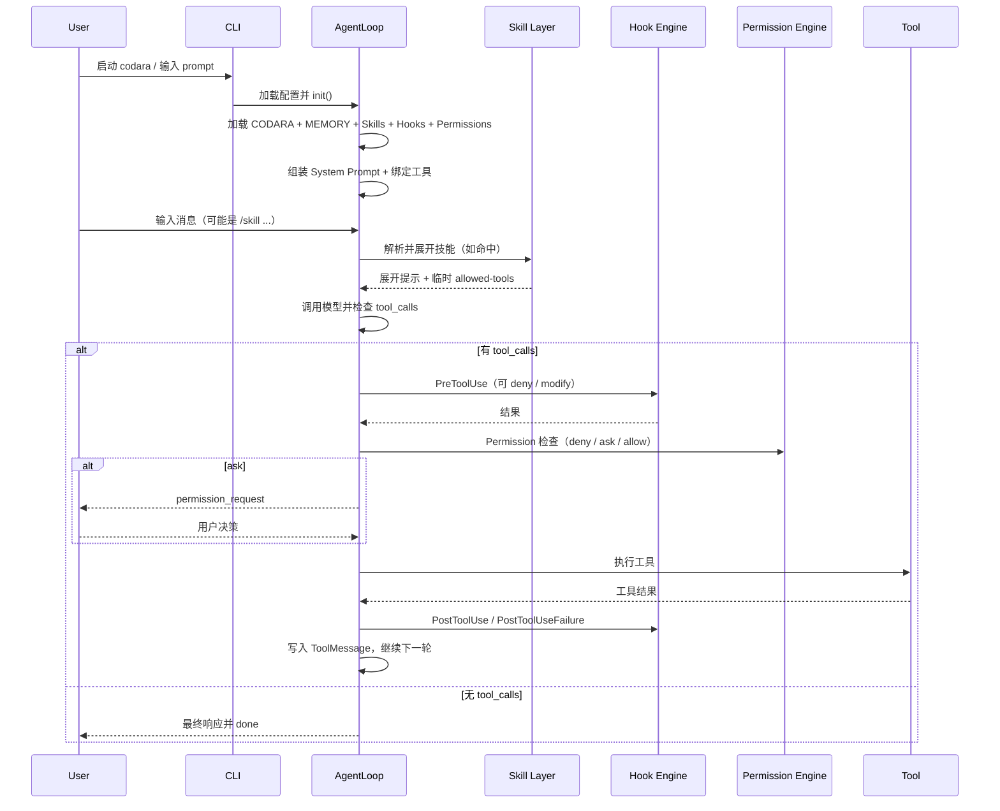

# Codara 架构运行流程

> 本文档详细说明 Codara 从启动到执行的完整运行流程，以及各个组件如何协同工作。

## 目录

### 宏观视角
0. [运行时一图流（唯一入口）](#0-运行时一图流唯一入口)
1. [启动流程](#1-启动流程)
2. [初始化阶段](#2-初始化阶段)
3. [执行阶段](#3-执行阶段)
4. [关键时间点](#4-关键时间点)

### 微观视角
5. [上下文注入机制](#5-上下文注入机制)
6. [Skills 运作机制](#6-skills-运作机制)
7. [Subagents 协作机制](#7-subagents-协作机制)
8. [Hooks 执行机制](#8-hooks-执行机制)
9. [Permissions 求值机制](#9-permissions-求值机制)

---

# 宏观视角

## 0. 运行时一图流（唯一入口）



**统一口径：**
- 主路径判断信号是 `tool_calls`；`stop_reason` 只做边缘状态处理。
- 工具调用关键顺序是 `PreToolUse -> Permissions -> Tool -> PostToolUse`。
- Skill Hooks 在初始化阶段加载并在会话内生效；`/skill-name` 主要影响提示注入与临时 `allowed-tools`。

### 按运行时阶段的开发切入点

| 阶段 | 常见改动 | 首选代码层 |
|------|----------|------------|
| 启动/初始化 | 配置加载、系统提示组装、技能发现 | `config` / `memory` / `skills loader` |
| 循环执行 | 回合控制、事件流、done 原因处理 | `agent loop` + middleware hooks |
| 工具调用 | 拦截、授权、审计、回滚 | `hooks` + `permissions` + `checkpoint` |
| 扩展编排 | 场景流程、项目策略、团队规范 | `skills`（优先） |

开发约束：
- 优先在不破坏主链路的前提下扩展（新增中间件或 skill），避免改动循环骨架。
- 涉及安全边界的改动必须同时检查 hooks 和 permissions 两层行为。

---

## 1. 启动流程

```
用户执行: codara

1. CLI 入口（启动编排层）
   ├─ 解析命令行参数 (commander)
   ├─ 加载配置文件
   │  ├─ settings.json (项目共享)
   │  └─ settings.local.json (本地覆盖)
   └─ 创建 AgentLoop 实例

2. 配置加载
   ├─ loadSettings(cwd)
   ├─ resolveConfig(opts, settings)
   └─ loadModelConfig(cwd)

3. Agent 初始化
   └─ agent.init()
```

---

## 2. 初始化阶段

### 2.1 上下文构建（静态注入）

```
agent.init() 执行顺序:

1. 检测 Git 根目录
   └─ 从 cwd 向上遍历查找 .git

2. 加载 CODARA.md (人工编写的项目指令)
   ├─ ~/.codara/CODARA.md (用户级)
   ├─ {git-root}/CODARA.md (项目级)
   └─ {git-root}/CODARA.local.md (本地级)

   优先级: 本地 > 项目 > 用户

3. 加载 MEMORY.md (AI 维护的记忆)
   └─ ~/.codara/projects/{hash}/memory/MEMORY.md
   └─ 读取前 200 行注入上下文

4. 发现 Skills
   ├─ 扫描 ~/.codara/skills/
   ├─ 扫描 .codara/skills/
   └─ 构建 skill 注册表

5. 组装系统提示词
   ├─ 基础提示词 (内置)
   ├─ CODARA.md 内容
   ├─ MEMORY.md 内容
   └─ 环境信息 (cwd, git status, etc)

6. 创建 LLM 模型
   ├─ 模型路由解析 (01-model-routing.md)
   ├─ 工具绑定 (9 个基础工具)
   └─ 配置 streaming

7. 触发 SessionStart 钩子
   └─ 执行用户配置的启动钩子
```

**关键点：**
- CODARA.md 和 MEMORY.md 在初始化时一次性加载
- Skills 在初始化时发现，但内容在调用时才注入
- 系统提示词在初始化时组装完成

---

## 3. 执行阶段

### 3.1 Agent Loop 核心循环

```
while (true) {
  1. 安全检查
     ├─ max_turns 检查
     ├─ max_budget 检查
     └─ abort 信号检查

  2. 上下文容量检查
     └─ 如果 > 95%，触发压缩

  3. 调用 LLM (streaming)
     └─ 收集 chunks

  4. 检查 tool_calls（主路径）
     ├─ 非空 → 执行工具流程（见下文）
     └─ 为空 → 进入结束路径

  5. 检查 stop_reason（辅助）
     ├─ "max_tokens" / "pause_turn" → 继续
     ├─ "refusal" → 结束
     └─ "context_exceeded" → 触发压缩后继续
}
```

### 3.2 工具执行流程

```
对于每个 tool_use:

1. PreToolUse 钩子
   ├─ 执行匹配的钩子
   ├─ 可以拒绝 (exit 2)
   ├─ 可以修改输入 (JSON action)
   └─ 短路：第一个拒绝立即停止

2. Permissions 检查
   ├─ 求值规则链 (见下文)
   ├─ 可能弹出对话框 (ask)
   └─ 可能拒绝 (deny)

3. 文件检查点 (仅 Write/Edit)
   └─ 快照当前文件内容

4. 执行工具
   └─ 调用工具实现

5. PostToolUse / PostToolUseFailure 钩子
   └─ 执行匹配的钩子

6. 追加 ToolMessage 到对话
   └─ 继续循环
```

---

## 4. 关键时间点

| 时间点 | 发生的事情 | 涉及组件 |
|--------|-----------|---------|
| **启动时** | 加载配置、创建 Agent | CLI, Config |
| **初始化时** | 加载 CODARA.md + MEMORY.md，发现 Skills 并注册 Skill Hooks | MemoryLoader, SkillLoader, HookEngine |
| **首次调用 LLM** | 系统提示词已包含 CODARA + MEMORY | SystemPrompt |
| **调用 /skill-name** | Skill 内容注入到当前消息 | SkillExecutor |
| **工具调用前** | PreToolUse 钩子 + Permissions 检查 | HookEngine, PermissionManager |
| **工具调用后** | PostToolUse 钩子 | HookEngine |
| **文件修改前** | 创建 Checkpoint | CheckpointSystem |
| **上下文 > 95%** | 触发压缩 | Compactor |
| **会话结束** | 保存 Session | SessionStore |

---

# 微观视角

## 5. 上下文注入机制

### 5.1 CODARA.md 注入

**何时读取：**
- Agent 初始化时（`agent.init()`）

**如何读取：**
```typescript
// 记忆加载层（概念示例）
function loadMemory(cwd: string): MemoryLayer[] {
  const layers: MemoryLayer[] = [];

  // 1. 用户级
  const userCodara = readFile('~/.codara/CODARA.md');
  if (userCodara) layers.push({ scope: 'user', content: userCodara });

  // 2. 项目级 (向上遍历到 git root)
  const gitRoot = findGitRoot(cwd);
  const projectCodara = readFile(`${gitRoot}/CODARA.md`)
                     || readFile(`${gitRoot}/.codara/CODARA.md`);
  if (projectCodara) layers.push({ scope: 'project', content: projectCodara });

  // 3. 本地级
  const localCodara = readFile(`${gitRoot}/CODARA.local.md`);
  if (localCodara) layers.push({ scope: 'local', content: localCodara });

  return layers;
}
```

**如何注入：**
```typescript
// 系统提示词组装层（概念示例）
function assembleSystemPrompt(layers: MemoryLayer[]): string {
  let prompt = BASE_PROMPT; // 基础提示词

  // 按顺序追加
  for (const layer of layers) {
    prompt += `\n\n# ${layer.scope}\n${layer.content}`;
  }

  return prompt;
}
```

**注入位置：**
- 系统提示词（`messages[0]`）
- 在 LLM 首次调用前已完成

---

### 5.2 MEMORY.md 注入

**何时读取：**
- Agent 初始化时（`agent.init()`）

**如何读取：**
```typescript
// 记忆加载层（概念示例）
function loadAutoMemory(gitRoot: string): string {
  const hash = md5(gitRoot).substring(0, 12);
  const memoryPath = `~/.codara/projects/${hash}/memory/MEMORY.md`;

  const content = readFile(memoryPath);
  if (!content) return '';

  // 只读取前 200 行
  const lines = content.split('\n');
  return lines.slice(0, 200).join('\n');
}
```

**如何注入：**
- 追加到系统提示词（在 CODARA.md 之后）
- 标记为 "Auto Memory" 部分

**何时更新：**
- AI 通过 Write/Edit 工具主动更新
- 无需重启，下次会话自动加载新内容

---

## 6. Skills 运作机制

### 6.1 Skill 发现

**何时发现：**
- Agent 初始化时（`agent.init()`）

**如何发现：**
```typescript
// 技能发现层（概念示例）
function discoverSkills(): Map<string, Skill> {
  const skills = new Map();

  // 1. 扫描用户级 skills
  const userSkills = scanDirectory('~/.codara/skills/');

  // 2. 扫描项目级 skills
  const projectSkills = scanDirectory('.codara/skills/');

  // 3. 合并（项目级覆盖用户级）
  for (const skill of [...userSkills, ...projectSkills]) {
    skills.set(skill.name, skill);
  }

  return skills;
}
```

**Skill 组成模块：**

| 模块 | 用途 |
|---|---|
| Skill 定义文档 | frontmatter 元数据 + 提示模板 |
| agents 能力包 | 自定义代理类型定义 |
| hooks 能力包 | Skill 专属钩子配置 |
| scripts 能力包 | 运行时辅助脚本 |

---

### 6.2 Skill 调用

**触发方式：**
- 用户输入 `/skill-name` 或 `/skill-name arg1 arg2`

**执行流程：**
```typescript
// 技能执行层（概念示例）
async function executeSkill(name: string, args: string[]) {
  // 1. 查找 skill
  const skill = skillRegistry.get(name);
  if (!skill) throw new Error(`Skill not found: ${name}`);

  // 2. 读取 SKILL.md
  const content = readFile(skill.path + '/SKILL.md');
  const { frontmatter, body } = parseFrontmatter(content);

  // 3. 参数替换
  let injectedContent = body;
  for (let i = 0; i < args.length; i++) {
    injectedContent = injectedContent.replace(`$${i + 1}`, args[i]);
  }

  // 4. 动态上下文注入
  injectedContent = injectDynamicContext(injectedContent, {
    cwd: process.cwd(),
    gitBranch: getCurrentBranch(),
    // ...
  });

  // 5. 注入到当前消息
  return {
    role: 'user',
    content: injectedContent
  };
}
```

**注入时机：**
- 用户消息发送前
- 作为独立的 UserMessage 追加到对话

**Skill 权限：**
```yaml
---
name: commit
allowed-tools:
  - Read(*)
  - Bash(git *)
---
```
- `allowed-tools` 临时添加到 permissions allow 规则
- 仅在 skill 执行期间生效

---

### 6.3 Skill Hooks

**加载时机：**
- Agent 初始化时（技能发现阶段）

**如何加载：**
```typescript
// 钩子引擎层（概念示例）
function loadSkillHooksAtInit(discoveredSkills: SkillDefinition[]) {
  for (const skill of discoveredSkills) {
    const fromHooksDir = readHooksJson(`${skill.basePath}/hooks/hooks.json`);
    const fromFrontmatter = skill.frontmatter.hooks;
    registerMergedHooks(fromHooksDir, fromFrontmatter, skill.basePath);
  }
}
```

**生命周期：**
- 会话启动时注册
- 会话结束时随 HookEngine 销毁
- `/skill-name` 调用本身只影响提示注入与临时 `allowed-tools`，不动态挂载/移除钩子

---

## 7. Subagents 协作机制

### 7.1 Subagent 创建

**触发方式：**
- 主 Agent 调用 `Task` 工具

**创建流程：**
```typescript
// 子代理编排层（概念示例）
async function createSubagent(params: {
  subagent_type: string,  // 'Explore' | 'Plan' | 'general-purpose'
  prompt: string,
  run_in_background?: boolean
}) {
  // 1. 查找 agent 定义
  const agentDef = findAgentDefinition(params.subagent_type);

  // 2. 解析 frontmatter
  const { tools, model, permissions, maxTurns, memory } = agentDef.frontmatter;

  // 3. 创建隔离的 AgentLoop
  const subagent = new AgentLoop({
    tools: filterTools(tools),           // 受限工具集
    model: model === 'inherit' ? parentModel : model,
    permissions: mergePermissions(parentPermissions, permissions),
    maxTurns: maxTurns || 20,
    messages: []  // 空对话历史
  });

  // 4. 加载 subagent 记忆 (如果配置了 memory)
  if (memory) {
    const memoryContent = loadSubagentMemory(agentDef.name, memory);
    subagent.injectMemory(memoryContent);
  }

  // 5. 执行
  const result = await subagent.run(params.prompt);

  // 6. 返回摘要 (不是完整输出)
  return summarize(result);
}
```

---

### 7.2 Agent 定义位置

**内置 Agents：**
```
.codara/skills/builtin-agents/agents/
├── Explore.md          # 快速搜索 (haiku, 只读)
├── Plan.md             # 架构设计 (只读)
└── general-purpose.md  # 完整能力
```

**自定义 Agents：**
```
.codara/skills/my-skill/agents/
└── custom-agent.md
```

**查找顺序：**
1. 项目级 `.codara/skills/*/agents/`
2. 用户级 `~/.codara/skills/*/agents/`
3. 内置 agents

---

### 7.3 Subagent 与 Skills 配合

**场景 1：Skill 定义专属 Agent**
```
.codara/skills/code-review/
├── SKILL.md
└── agents/
    └── reviewer.md     # 专门用于 code review 的 agent
```

调用：
```
用户: /code-review
  → Skill 内容注入
  → Skill 可以调用 Task(subagent_type='reviewer', ...)
  → reviewer agent 执行审查
  → 返回结果给主 agent
```

**场景 2：通用 Agent 执行 Skill 任务**
```
用户: /commit
  → Skill 内容注入（包含 commit 指令）
  → 主 agent 可以调用 Task(subagent_type='general-purpose', prompt='...')
  → Subagent 执行具体任务
```

---

## 8. Hooks 执行机制

### 8.1 Hook 配置加载

**何时加载：**
- Agent 初始化时

**如何加载：**
```typescript
// 钩子引擎层（概念示例）
function loadHooks(settings: Settings): HookConfig {
  const hooks: HookConfig = {};

  // 1. 从 settings.json 加载
  if (settings.hooks) {
    Object.assign(hooks, settings.hooks);
  }

  // 2. 从 settings.local.json 加载（覆盖）
  if (settings.local?.hooks) {
    Object.assign(hooks, settings.local.hooks);
  }

  return hooks;
}
```

---

### 8.2 Hook 触发

**PreToolUse 示例：**
```typescript
// 代理循环层（概念示例）
async function executeToolCall(toolCall: ToolCall) {
  // 1. 触发 PreToolUse 钩子
  const hookResult = await hookEngine.trigger('PreToolUse', {
    tool: toolCall.name,
    input: toolCall.input
  });

  // 2. 检查结果
  if (hookResult.denied) {
    return {
      error: hookResult.reason,
      denied: true
    };
  }

  // 3. 使用修改后的输入（如果有）
  const actualInput = hookResult.modifiedInput || toolCall.input;

  // 4. 继续执行...
}
```

**Hook 执行：**
```typescript
// 钩子引擎层（概念示例）
async function executeHook(hook: Hook, context: HookContext): Promise<HookResult> {
  if (hook.type === 'command') {
    // 1. 设置环境变量
    const env = {
      HOOK_EVENT: context.event,
      TOOL_NAME: context.tool,
      TOOL_INPUT: JSON.stringify(context.input),
      // ...
    };

    // 2. 通过 stdin 传递 JSON
    const stdin = JSON.stringify(context);

    // 3. 执行命令
    const result = await exec(hook.command, { env, stdin, timeout: 10000 });

    // 4. 解析退出码
    if (result.exitCode === 2) {
      return { denied: true, reason: result.stderr };
    }

    // 5. 解析 stdout JSON action
    if (result.exitCode === 0 && result.stdout) {
      try {
        const action = JSON.parse(result.stdout);
        if (action.action === 'deny') {
          return { denied: true, reason: action.reason };
        }
        if (action.action === 'modify') {
          return { modifiedInput: action.modifiedInput };
        }
      } catch {}
    }

    return { approved: true };
  }

  // 其他 hook 类型...
}
```

---

## 9. Permissions 求值机制

### 9.1 规则加载

**何时加载：**
- Agent 初始化时

**如何加载：**
```typescript
// 权限管理层（概念示例）
function loadPermissions(settings: Settings): PermissionRules {
  return {
    mode: settings.permissions?.defaultMode || 'default',
    allow: settings.permissions?.allow || [],
    deny: settings.permissions?.deny || [],
    ask: settings.permissions?.ask || []
  };
}
```

---

### 9.2 求值流程

```typescript
// 权限管理层（概念示例）
async function checkPermission(tool: string, input: any): Promise<PermissionResult> {
  // 1. bypassPermissions 模式
  if (mode === 'bypassPermissions') {
    return { allowed: true };
  }

  // 2. plan 模式特判
  if (mode === 'plan') {
    if (isReadOnly(tool)) return { allowed: true };
    if (tool === 'Bash') return { ask: true };
    if (isWrite(tool)) return { denied: true, reason: 'Plan mode: write denied' };
  }

  // 3. deny 规则
  if (matchesAny(tool, input, rules.deny)) {
    return { denied: true, reason: 'Denied by rule' };
  }

  // 4. ask 规则
  if (matchesAny(tool, input, rules.ask)) {
    return { ask: true };
  }

  // 5. allow 规则（包含 skill 临时规则）
  if (matchesAny(tool, input, [...rules.allow, ...skillAllowedTools])) {
    return { allowed: true };
  }

  // 6. 只读工具豁免
  if (isReadOnly(tool)) {
    return { allowed: true };
  }

  // 7. acceptEdits 模式
  if (mode === 'acceptEdits' && isWrite(tool)) {
    return { allowed: true };
  }

  // 8. dontAsk 模式
  if (mode === 'dontAsk') {
    return { denied: true, reason: 'Not pre-approved' };
  }

  // 9. default 模式 - 询问用户
  return { ask: true };
}
```

**规则匹配：**
```typescript
function matchesRule(tool: string, input: any, rule: string): boolean {
  // 规则格式: "ToolName(pattern)"
  const [toolPattern, inputPattern] = parseRule(rule);

  // 1. 工具名匹配 (glob)
  if (!minimatch(tool, toolPattern)) return false;

  // 2. 输入匹配 (如果有)
  if (inputPattern) {
    // 对于 Bash: 只匹配第一个命令段
    if (tool === 'Bash') {
      const command = input.command.split(/[;&|]/)[0].trim();
      return minimatch(command, inputPattern);
    }

    // 对于文件操作: 匹配文件路径
    if (input.file_path) {
      return minimatch(input.file_path, inputPattern);
    }
  }

  return true;
}
```

---

## 架构总结

```
启动
  ↓
初始化
  ├─ 加载 CODARA.md (静态配置)
  ├─ 加载 MEMORY.md (AI 记忆)
  ├─ 发现 Skills
  ├─ 加载 Hooks
  ├─ 加载 Permissions
  └─ 组装系统提示词
  ↓
执行循环
  ├─ LLM 调用
  ├─ 工具执行
  │  ├─ PreToolUse Hook
  │  ├─ Permission 检查
  │  ├─ Checkpoint (Write/Edit)
  │  ├─ 执行工具
  │  └─ PostToolUse Hook
  ├─ Skill 调用 (/skill-name)
  │  ├─ 注入 Skill 内容
  │  └─ 应用 Skill Permissions
  └─ Subagent 调用 (Task 工具)
     ├─ 创建隔离 Agent
     ├─ 加载 Agent 记忆
     └─ 返回摘要
  ↓
结束
  └─ 保存 Session
```

**关键设计原则：**
1. **静态配置在初始化时加载一次**（CODARA.md）
2. **动态记忆持续演化**（MEMORY.md）
3. **Skills 按需注入**（调用时才加载内容）
4. **Hooks 在关键点触发**（PreToolUse, PostToolUse, etc）
5. **Permissions 在工具执行前求值**（deny → ask → allow）
6. **Subagents 完全隔离**（独立上下文、受限工具）

---

> 相关文档：
> - [00-架构概览](./00-architecture-overview.md) - 整体架构
> - [02-代理循环](./02-agent-loop.md) - 执行引擎
> - [05-记忆系统](./05-memory-system.md) - MEMORY.md 机制
> - [06-技能系统](./06-skills.md) - Skills 详细说明
> - [07-代理协作](./07-agent-collaboration.md) - Subagents 详细说明
