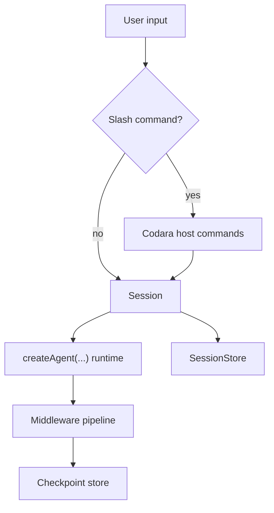
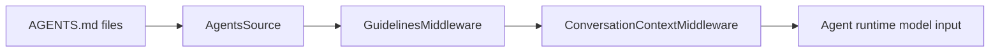
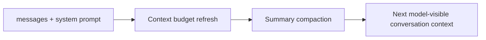
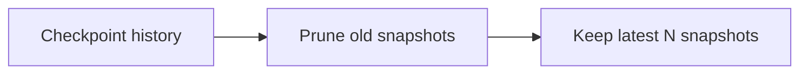
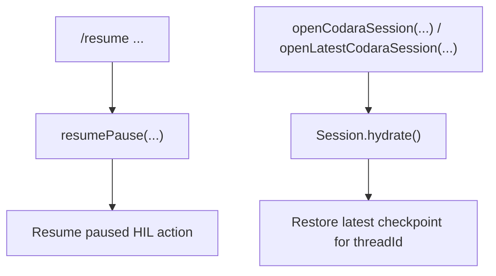
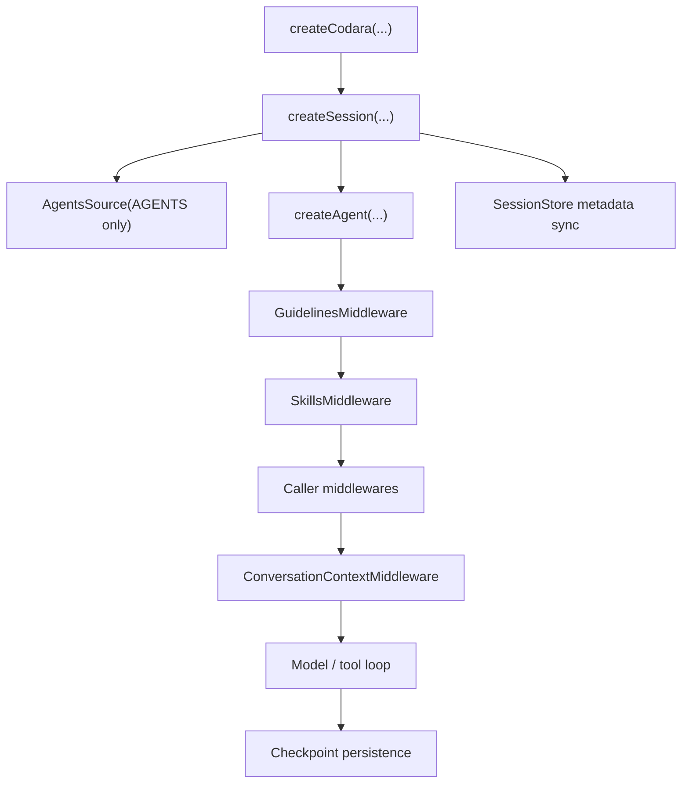
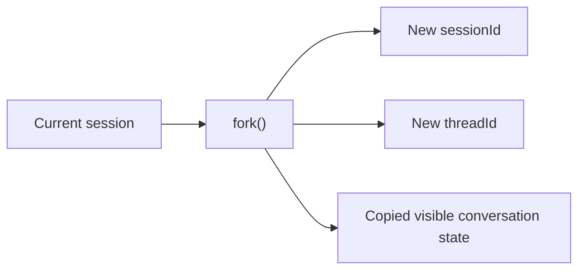

# Conversation Lifecycle Architecture

This document describes the current Codara conversation lifecycle after the
`AGENTS.md + session + checkpoint + compact + slash commands` cleanup.

The goal is to keep the system close to the internal mental model used by
Claude Code while preserving Codara's own `createAgent(...)`-first runtime.

## Core Roles

- `createAgent(...)`
  - The only execution kernel.
  - Owns runtime state: `messages`, `context`, `values`, `pendingPause`.
  - Runs the loop, tools, checkpoint restore, and HIL pause/resume.
- `Session`
  - The conversation host.
  - Owns `threadId`, source reload, hydration, checkpoint compaction, and
    pause-resume entrypoints.
- `SessionStore`
  - The conversation catalog.
  - Stores metadata such as `sessionId`, `threadId`, title, and last activity.
- `CheckpointStore`
  - Runtime snapshot history only.
  - Stores conversation runtime state, not source files.
- `AGENTS.md`
  - The only long-lived instruction source.
  - Acts as Codara's equivalent of Claude Code's `CLAUDE.md`.

## Host vs Runtime

The key rule is:

- host commands stay outside `createAgent(...)`
- runtime execution stays inside `createAgent(...)`

## AGENTS Memory Flow

`/memory` does not create a second memory system. It only helps the host work
with the same `AGENTS.md` source chain already used by the runtime.

Current `/memory` behavior:

- `/memory`
  - shows the current global/project `AGENTS.md` targets
  - shows which paths are currently loaded
- `/memory project`
  - ensures the project target exists and returns an `open_file` host action
- `/memory global`
  - ensures the global target exists and returns an `open_file` host action
- `/reload`
  - invalidates the session source cache so the next turn re-reads `AGENTS.md`
  - refreshes the skills discovery cache so skill-derived slash commands stay in sync

This keeps `AGENTS.md` as the only long-lived source and avoids resurrecting
the old `MEMORY.md` split.

## Compact Semantics

There are two different compact paths and they must remain separate.

### 1. Conversation compact

- Triggered automatically by `ConversationContextMiddleware`
- Can also be forced manually with `/compact`
- Affects future model-visible conversation history
- Does **not** delete checkpoint files

### 2. Checkpoint compact

- Triggered manually with `/compact checkpoints [keepLast]`
- Only affects stored runtime history
- Does **not** generate a summary
- Must preserve a valid parent chain for the retained snapshots

## Resume Semantics

These two flows are intentionally different:

- `resumePause(...)`
  - only resumes a paused action
- `openCodaraSession(...)`
  - reopens a conversation
- `openLatestCodaraSession(...)`
  - reopens the most recently active conversation

This keeps "resume a pause" separate from "reopen a conversation".

## SessionStore vs CheckpointStore

This is the most important boundary to keep clean.

| Layer | Stores | Purpose |
| --- | --- | --- |
| `SessionStore` | `sessionId`, `threadId`, title, last activity, last message | list/open/latest conversations |
| `CheckpointStore` | `messages`, `context`, `values`, `pendingPause`, parent chain | restore runtime state |

In short:

- `SessionStore` is the catalog
- `CheckpointStore` is the runtime history

They are related, but not interchangeable.

## Default Conversation Lifecycle

Current defaults:

- default model alias resolves to `sonnet`
- default input budget derives from model metadata (`contextWindow`, `maxOutputTokens`)
- `AGENTS.md` is cached per session and reloaded on `/reload`
- conversation compaction auto-triggers when estimated usage reaches roughly
  `95%` of the usable input budget
- `/compact` can still force compaction immediately
- `/compact checkpoints` is storage-only

## Fork / Branching

Multiple windows should not silently compete for the same latest checkpoint if
they are meant to diverge.

Codara now exposes an explicit `fork()` path on `Session` / `Codara`.

Forking creates a new branch by:

- cloning the current visible conversation state
- assigning a new `sessionId`
- assigning a new `threadId`
- recording the source branch in session metadata

This keeps branching explicit instead of letting two windows race on one shared
latest checkpoint pointer.

## Design Guardrails

- Do not add a second memory file system next to `AGENTS.md`
- Do not push host commands into `createAgent(...)`
- Do not mix checkpoint history pruning with conversation summarization
- Do not let `SessionStore` absorb runtime state
- Do not let `CheckpointStore` become a conversation catalog
