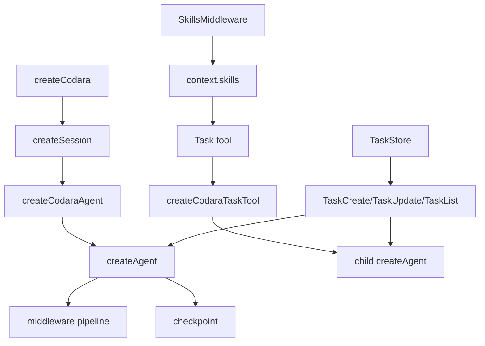
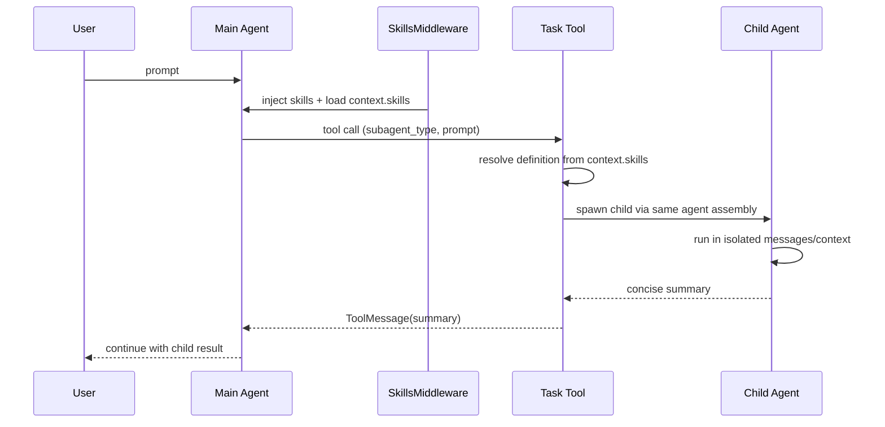

# Subagent / Task Runtime Architecture

## Goal

当前主线只聚焦三件事：

- `subagent`：委派执行原语
- `Task`：正式委派工具
- `TaskCreate/TaskUpdate/TaskList`：共享任务协调层

明确不在当前范围内：

- `team`
- 后台编排 runtime
- 多 session 团队协作层

## Layering

## Delegation Flow

## Middleware Order

当前默认 Codara 中间件顺序：

1. `logging`
2. `guidelines`
3. `memory`
4. `summary`
5. `skills`
6. caller middlewares
7. `hil`

这条顺序的意义：

- `guidelines/memory/summary/skills` 都服务 agent
- `skills` 在模型调用前把 `agents/*.md` 解析结果放入 `context.skills`
- `Task` 只消费这份 runtime data，不再自己查 store

## Tools Map

### Agent-internal

- `write_todos`
  - 单 agent 内部执行状态
  - 数据落在 `state.values`

### Delegation

- `delegate_to_subagent`
  - 低层 primitive
  - 直接受约束复用 `createAgent(...)`
- `Task`
  - 正式委派入口
  - definition 来自 `agents/*.md`
  - 默认继承与 main 相同的装配

### Shared coordination

- `TaskCreate`
- `TaskUpdate`
- `TaskList`

它们通过 `TaskStore` 暴露共享任务数据，不属于单 agent 内部状态。

## Current Capability Boundaries

### Todo

- 属于单个 agent
- 存放在 `state.values`
- checkpoint 可恢复
- 不跨 agent 共享

### Subagent

- 与 main agent 是同一种 agent runtime
- 只是 `agentType = subagent`
- 独立消息、上下文、checkpoint 边界
- 禁止继续派发 subagent

### Task

- `Task` = 委派型工具
- `TaskCreate/TaskUpdate/TaskList` = 共享协调工具
- 二者职责明确分开

## Current Gaps

### P0

- `createTaskTool(...)` 在 core 通用层仍保留少量高级扩展钩子，public 心智还可以继续压薄。
- `skills/agents.ts` 现在会把 `model/middleware/permissionMode` 解析为 `definition.hints`，明确它们是提示性元数据，而不是自动 runtime 覆盖；后续仍应继续克制，不把 hints 重新做成隐式装配入口。

### P1

- 缺少一份统一的 runtime architecture 文档入口，当前信息分散在 `README`、测试和对话里。
- middleware / tools / task / subagent 的 capability matrix 还没有单独的维护位置。

### P2

- 还没有后台 subagent/task runtime。
- 还没有权限执行层，只保留了 `HIL` 协议原语。

## Test Map

按能力边界，当前推荐测试组织：

- `tests/unit/agents/subagent.test.ts`
  - subagent primitive
- `tests/unit/agents/subagent-task.test.ts`
  - subagent 与 shared task store 的交互
- `tests/unit/agents/task-tool-delegation.test.ts`
  - Task 基本委派
- `tests/unit/agents/task-tool-filtering.test.ts`
  - Task tool filtering
- `tests/unit/agents/task-tool-definitions.test.ts`
  - Task definition resolution
- `tests/unit/agents/task-tool-runtime.test.ts`
  - Task runtime overrides
- `tests/unit/agents/task-tool-limits.test.ts`
  - Task maxTurns
- `tests/unit/agents/task-tool-errors.test.ts`
  - Task error paths
- `tests/unit/core/codara-task-tool.test.ts`
  - Codara task assembly behavior

## Suggested Next Improvements

1. 继续压薄 `createTaskTool(...)` 的 public surface，只保留正常使用真正需要的参数。
2. 继续收紧 `SubagentDefinition` 的有效字段与 hints 边界，避免未来再把 hints 做成隐式 runtime 覆盖。
3. 单独补一份 middleware/tool capability matrix 文档，避免后续重复讨论边界。
